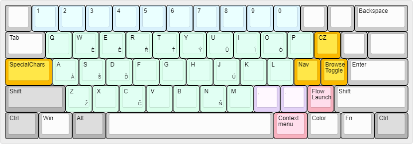
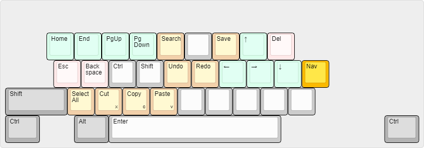
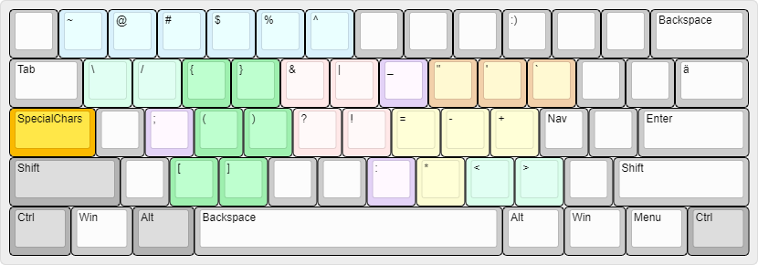
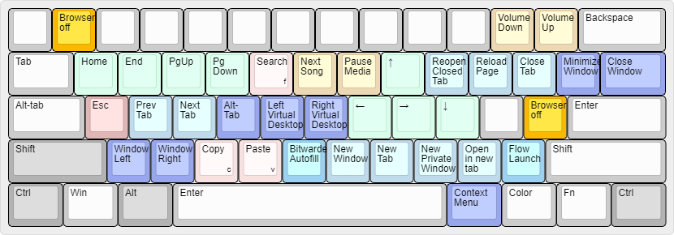

# Keyboard Layout

My custom keyboard remap with multiple layers using AutoHotKey V2.

[Inspired by!](https://github.com/MatejKafka/KeyboardRemap)

## Layout diagrams

### Base layer

This layer is active by default.

### Navigation layer

This layer is active momentarily while one of the **Mod Nav** keys (`ISO \` or `;`) is held.

### SpecialChars layers

This layer is active momentarily while the **Mod SpecialChars** key (`CapsLock`) is held.

### Browser mode

This layer is activated using one of the `Browser mode toggle` and `Browser mode on` keys in the other layers. 

The provided `capsicain.ahk` AutoHotkey script renders a small GUI indicator in the lower right corner of my screen, which changes color when browser mode is active. To hide this indicator, press `Ctrl-PrintScreen`. To show it again, press `Shift-PrintScreen`.

